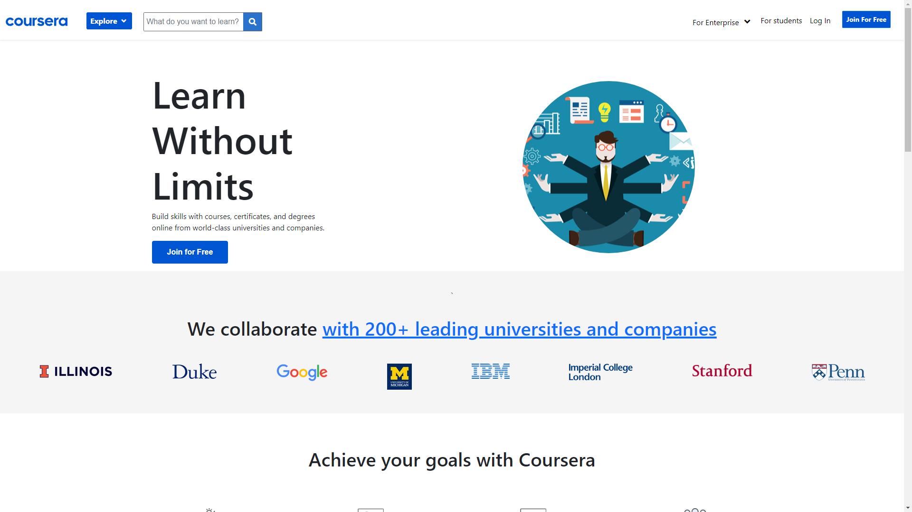
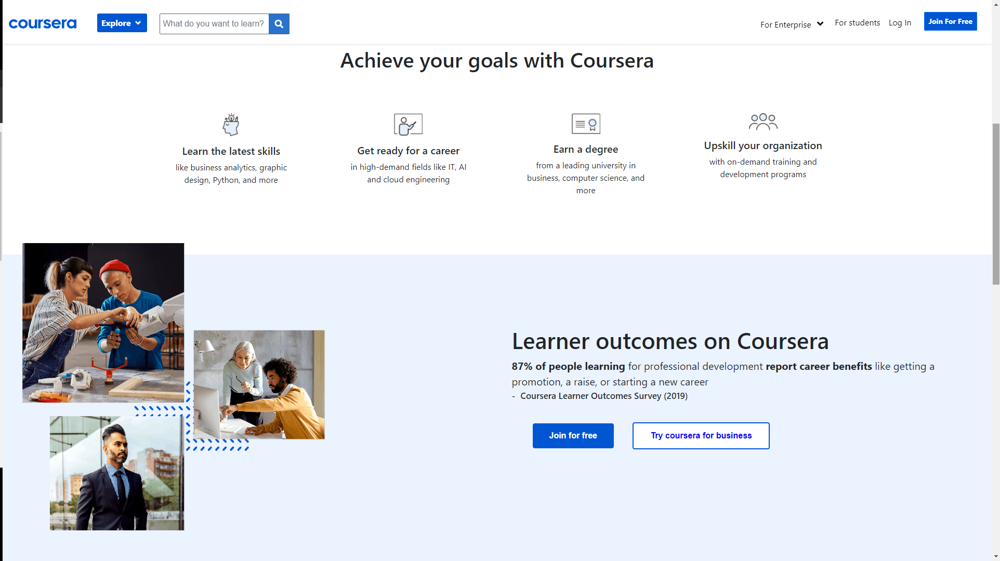
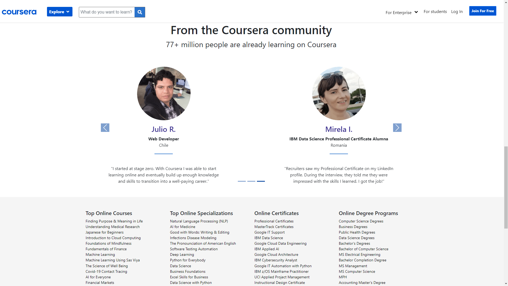

# Welcome to the football_Project_API [Demo](https://mohammadalnajar.github.io/HYF-Module-HTMLCSSGIT/week-3/Coursera-clone/)

#### This HTML & CSS project was a part of my study in the HTML&CSS_module at HackYourFuture institute in Amsterdam.

- The idea was cloning one page of a website to practice html and css frameworks
  like **Bootstrap**

#### The page consists of the following parts:

1. **Nav** 
2. **Header** 
3. **Cards section** 
4. **Footer** 

    <div style="display: flex; flex-wrap:wrap">
      
      
      
    </div>

5. The page is mobile ***Responsive*** which means everything will fit well at small
   screens as well.

___
### Languages and tools:

- **HTML**
- **CSS**
- Some **Javascript** 

#### Libraries and Frameworks:

- **Bootstrap 5**
____

## Folder Structure:

```
 ┣ src
 ┃ ┗ images                     ## all images used
 ┣ index.html                   ## main html file
 ┣ README.md
 ┣ script.js
 ┗ style.css                    ## external css file
```